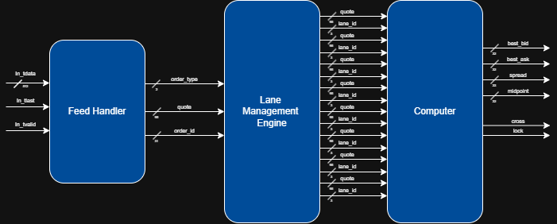
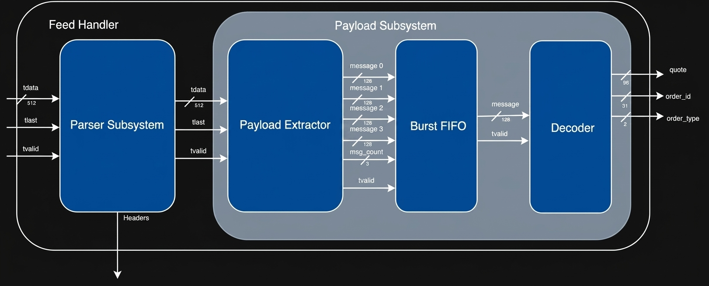

# FPGA Market Data Engine

Current state: Every module works individually. Debugging top module assembly.

A fully pipelined, low-latency market data processing engine implemented in SystemVerilog,
targeting the **Xilinx Artix-7 XC7A200T** FPGA. The system ingests raw Ethernet frames over
a 512-bit AXI-Stream bus, strips network headers, extracts and decodes market order messages,
manages an 8-lane active order book, and generates trading signals in **12 pipeline
cycles + a fifo** at **211 MHz**.

---

## Performance

| Metric                 | Value               |
|------------------------|---------------------|
| FPGA                   | XC7A200T-FFG1156-2L |
| Fmax                   | 211.1 MHz           |
| AXI Stream Width       | 512-bit             |
| Fixed Pipeline Latency | 12 cycles           |
| FIFO Depth             | 32                  |
| LUT Usage              | 4,540               |
| FF Usage               | 6,891               |
| BRAM                   | 8                   |

---

## Architecture Overview

<!-- IMAGE: Top-level block diagram showing the four major stages as boxes with arrows:
     Feed Handler → Decoder → Lane Management Engine → Computer.
     Show the 512-bit AXI bus entering Feed Handler and the signal outputs
     (cross, lock, spread, midpoint) leaving Computer.
     Suggested filename: docs/images/architecture_overview.png -->

The pipeline is divided into three major sections:

### 1. Feed Handler
Receives raw Ethernet frames on a 512-bit AXI-Stream bus. The Parser Subsystem strips
ETH, IPv4, and UDP headers from the first beat only. The Payload Subsystem then operates
a sliding window across all beats, stitching carry-over bits with incoming data to
continuously produce **4 aligned 128-bit messages per cycle**, rate-matches the 4 messages per
cycle to 1 message per cycle using a burst FIFO, and the messaes are decoded into `order_type`, 
`order_id`, `side`, `price`, `timestamp`, and `size`. 

### 2. Lane Management Engine
Maintains **8 parallel lanes** of active orders in registers. Incoming messages are handled
according to their type:

- `QUOTE` — allocated to the first free lane
- `FILL` / `CANCEL` — matched to a lane by `order_id` via one-hot comparison and the corresponding lane is set to '0
- Stale orders are evicted automatically when `age_delta > AGE_TIMEOUT` (default: 300 cycles)

### 3. Computer
Processes all 8 lanes in parallel, building on my other repo [Top-of-Book-FPGA-Engine](https://github.com/paulodietricheng/Top-of-Book-FPGA-Engine.git)

- **Canonicalization:** timestamps are bitwise-inverted on all quotes. Ask prices are also bitwise-inverted. Bids and asks are
  split into separate streams.
- **Scoring:**  Concatenates the canonical quote with the lane id for deterministic arbitration, where higher lane ids have priority.
- **Arbitration:** Selects the best bid and best ask across all active lanes via O(log2(N)) pipelined tournament tree.
- **Signal Generation:** Computes spread, midpoint, and detects market cross and lock
  conditions in a single registered stage.

---

## Output Signals

| Signal       | Description                                      |
|--------------|--------------------------------------------------|
| `best_bid`   | Best active bid quote across all lanes           |
| `best_ask`   | Best active ask quote across all lanes           |
| `spread`     | `ask.price − bid.price` (signed, 33-bit)         |
| `midpoint`   | `(bid.price + ask.price) / 2`                    |
| `cross_true` | Asserted when spread is negative (bid > ask)     |
| `lock_true`  | Asserted when spread is exactly zero             |

---

## Toolchain

- **HDL**: SystemVerilog
- **Synthesis & Implementation**: Xilinx Vivado
- **Target Device**: XC7A200T-FFG1156-2L (Artix-7)
- **Simulation**: Vivado Simulator (xsim)
